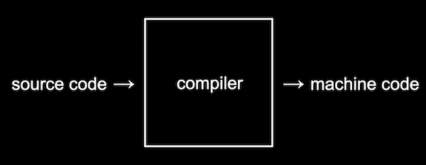

# CS50

22.07.26

##### https://www.edx.org/course/introduction-computer-science-harvardx-cs50x?g_acctid=724-505-4034&g_campaign=gs-b2c-nonbrand-tier1geo-partner-harvard-core&g_campaignid=15417765031&g_adgroupid=131210224478&g_adid=588991333656&g_keyword=cs%2050&g_keywordid=kwd-298145077103&g_network=g&utm_source=google&utm_campaign=gs-b2c-nonbrand-tier1geo-partner-harvard-core&utm_medium=cpc&utm_term=cs%2050&hsa_acc=7245054034&hsa_cam=15417765031&hsa_grp=131210224478&hsa_ad=588991333656&hsa_src=g&hsa_tgt=kwd-298145077103&hsa_kw=cs%2050&hsa_mt=e&hsa_net=adwords&hsa_ver=3&gclid=Cj0KCQjw_viWBhD8ARIsAH1mCd5UwufQqhkxbIgWW_LfrizNqk0gvAgWlk5R0aL0TLEAFKidLvvvgB4aAt0LEALw_wcB


_ David J. Malan


### Topics

abstraction, algorithms, data structures, encapsulation, resource management, security, software engineering, and web development.


### Welcome

computer science was less about ***'programming'*** than about ***'problem solving'***

but we should think of **problem solving**

 

### What is CS ?

We can think of **problem solving** as the process of taking some 

***input*** (a problem we want to solve) and 

generate some ***output*** (the solution to our problem).


#### Representing Numbers

**decimal** : 10진법 (인간의 셈법)

**binary** : 2 진법 (컴퓨터의 셈법)  (turnning on/off of transistors _ around bilions)

- Each *binary digit* is also called a **bit**.

  

#### Text

numbers map to letter

***ASCII*** _ standard mapping

***Unicode*** _ letters with accent marks and symbols in other languages  or even EMOJI !!!


#### Images , Video , Sounds 

With bits, we can map numbers to colors as well. (like **RGB**)

72,73,33 indicate the amount of red, green, and blue

Music - **MIDI**


#### Algorithms

Algoriths _ The black box that transforms inputs to outpus  : step-by-step instructions for solving problems

n = a number representing the size of the problem

log = dividing the phone book in half each time


#### Pseudocode

representation of our algorithm

ex) conditional / boolean expression / loop / functions  etc.


#### C

22.7.28


the quality of our code

- **correctness**, or whether our code solves our problem correctly
- **design**, or how well-written our code is, based on how efficient and readable it is
- **style**, or how well-formatted our code is visually


```c
int main(void)
{
    printf("hello, world\n");
}
```

Process 

1. translate code to binary.

2. type this code in IDE, VS Code

3. convert it to machine code

   

4. command-line interface showed in Terminal


Feature

- string should be surrounded with double quotes `""`
- semicolon `;` to indicate the end of the code
  - ex )  printf("hello, world") ; 
  - ex)   string answer = get_string("what's your name? ") ;
  - `=` is the assignment operator


#### Debugging

**debugging** is the process of finding and fixing those bugs


#### Memory

- Inside our computers, we have chips called RAM, random-access **memory**, that stores zeroes and ones. We can think of bytes stored in RAM as though they were in a grid, one after the other:
- In reality, there are millions or billions of bytes per chip.


#### Arrays


***code smell??***

Since we can set and access items in an array based on their position, and that position can *also* be the value of some variable, we can actually use a for loop


### Characters & String


